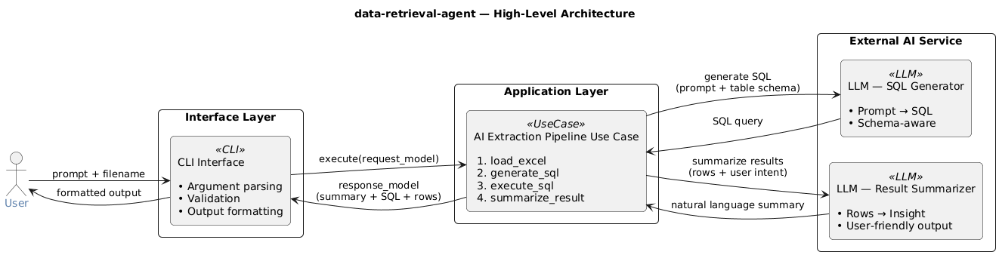
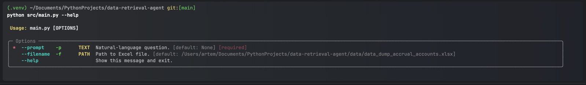
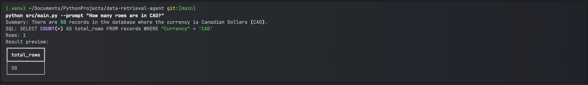

# data-retrieval-agent

This project would help for non-technical users to make data profiling on Excel files.
It loads data with pandas, asks OpenAI to generate the SQL query, runs it, and returns:

- a short natural-language summary,
- generated SQL,
- row count,
- and a preview table (up to 10 rows).

## Stack

- Python 3.11+
- Typer (CLI)
- pandas + openpyxl (Excel loading)
- pandasql (SQL over DataFrame)
- openai (`gpt-4o-mini`)
- rich (table output)
- ruff + pytest (quality checks)

## Architecture



## Setup

```bash
# 1) Create virtual environment
python -m venv .venv

# 2) Activate virtual environment
source .venv/bin/activate  # Windows PowerShell: .\.venv\Scripts\Activate.ps1

# 3) Install Poetry
python -m pip install --upgrade pip
python -m pip install poetry

# 4) Install project dependencies
python -m poetry install

# 5) Create .env from template
cp .env.example .env  # Windows PowerShell: Copy-Item .env.example .env
```

Set `OPENAI_API_KEY` in `.env`.

## Run

Default dataset:

```bash
python src/main.py --prompt "How many rows are in the file?"
```

Custom dataset:

```bash
python src/main.py --prompt "How many rows are in the file?" --filename "/absolute/path/to/file.xlsx"
```

Help:

```bash
python src/main.py --help
```




## Prompt Examples

| Prompt                                       | Expected answer |
|----------------------------------------------|-----------------|
| How many rows are in the file?               | 13,152          |
| How many columns are in the file?            | 19              |
| How many duplicate rows exist?               | 0               |
| How many rows are in CAD?                    | 50              |
| How many distinct currencies exist?          | 2               |
| How many rows have Authorization Group = 40? | 346             |
| What is the average Transaction Value?       | 	-5,993.932     |

## Sample Outputs

```bash
python src/main.py --prompt "How many rows are in the file?"
Summary: The file contains a total of 13,152 rows.
SQL: SELECT COUNT(*) AS total_rows FROM records
Rows: 1
```

```bash
python src/main.py --prompt "How many columns are in the file?"
Summary: The file contains a total of 19 columns.
SQL: SELECT 19 AS total_columns
Rows: 1
```

```bash
python src/main.py --prompt "How many duplicate rows exist?"
Summary: There are no duplicate rows in the dataset, as the count of total rows matches the count of unique rows.
SQL: SELECT COUNT(*) - COUNT(DISTINCT "Unnamed: 0") AS duplicate_rows FROM records
Rows: 1
```

```bash
python src/main.py --prompt "How many rows are in CAD?"
Summary: There are 50 records in the database where the currency is Canadian Dollars (CAD).
SQL: SELECT COUNT(*) AS total_rows FROM records WHERE "Currency" = 'CAD'
Rows: 1
```

```bash
python src/main.py --prompt "How many distinct currencies exist?"
Summary: There are two distinct currencies recorded in the dataset.
SQL: SELECT COUNT(DISTINCT "Currency") AS total_currencies FROM records
Rows: 1
```

## Quality

```bash
python -m poetry run ruff check .
python -m poetry run ruff format .
python -m poetry run pytest
```
